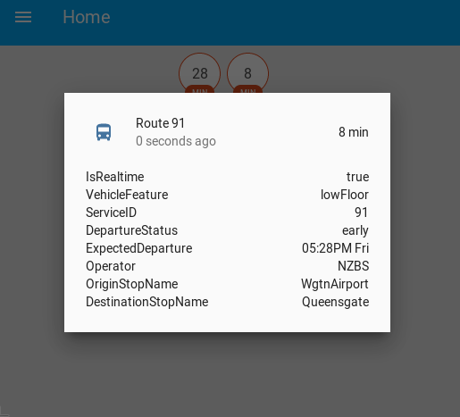
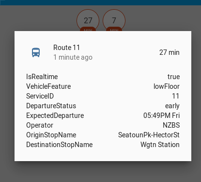

[](https://travis-ci.org/Br3nda/metlink-wellington-homeassistant)

## Show the RTI (real time info) expected arrival time of the next bus




### Example config

This is Willis street Grand Arcade. Find your stop number at the stop itself, or on https://www.metlink.org.nz/

```
sensor:
  - platform: metlink
    stop_number: 5008
    route_number: 11
  - platform: metlink
    stop_number: 5008
    route_number: 43
  - platform: metlink
    stop_number: 5008
    route_number: 91
```

## Credit

Based on the research of @reedwade https://github.com/reedwade/metlink-api-maybe
